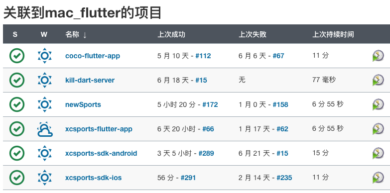

# 打包交接文档

## flutter-app打包
### Jenkins地址&admin账密
```
Jenkins地址：http://192.168.60.246:8080/
账号：admin 密码：91934f614b384dc387a50dce28406acd
```

### 旧打包机器(Mac 虚拟机)
```
旧打包机器：mac_flutter
远程登录IP：192.168.60.247，用户名：admin 密码：空
coco-flutter-app：乐动体育（已停止维护）
newSports：新体育
xcsports-flutter-app：AISDK-App包
xcsports-sdk-android：AISDK-AndroidSDK
xcsports-sdk-ios：AISDK-iOSSDK
```

***
### 新打包机器(Mac 虚拟机)
```
新打包机器：mac_flutter_new
远程登录IP：192.168.60.248，用户名：admin 密码：空
coco-app：乐动体育（已停止维护）
newSports-app：新体育
xcsports-app：AISDK-App包
sdk-android：AISDK-AndroidSDK
sdk-ios：AISDK-iOSSDK
```


***
***
***
### 构建流程
#### 1、Jenkins页面或远程连接触发构建
#### 2、执行指定项目构建->配置->构建中shell脚本
#### 3、克隆通用脚本与指定项目代码
#### 4、执行指定项目内打包脚本
#### 5、将构成功后将生成IPA，APK，zip包统一放到打包机桌面
#### 6、将IPA，APK，zip复制到http://192.168.60.245/，然后从桌面删除
***
#### 图1

***
#### 图2

***
#### 图3


***
***
***
### 构建错误处理流程
#### 1、找到对应构建

#### 2、查看日志并搜索错误日志
`构建号->控制台输出` <br>


#### 3、构成错误分析
`如上图，很简单可判断出是代码问题，TeamFilterBar没定义，是有同事代码没提全导致，通过git提交记录找到对应同事解决问题` 
#### 4、常见构成错误
```
1、代码问题，代码没提全导致编译不过
2、网络问题，因为打包拉取依赖包需要网络，如果运维不小心把打包机对应IP网络限制了，会导致拉取依赖超时，然后进入无限重试；如果打包时间超长基本就是网络问题，找Dee或Davis开通网络
3、依赖需要VPN翻墙
  3.1：安卓某些依赖更新导致需要更新gradle，需要远程进入虚拟机设置科学上网
  3.2：iOS在更新新的依赖库的时候，pod install可能会失败，更新cocoapods可能会超时，远程进入虚拟机设置科学上网可解决
```
