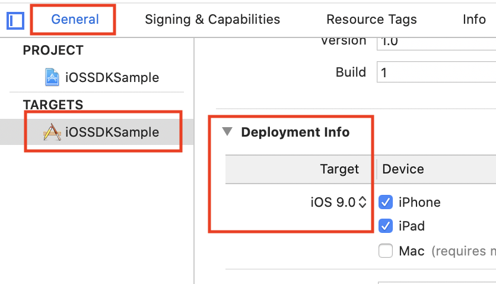
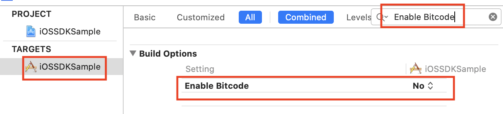
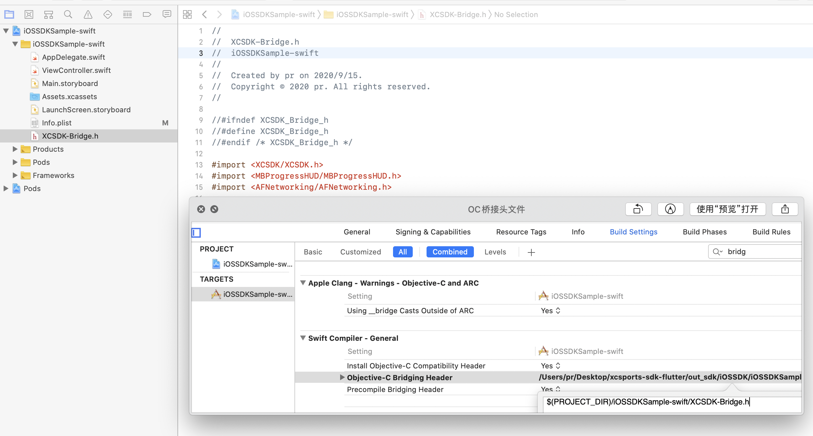
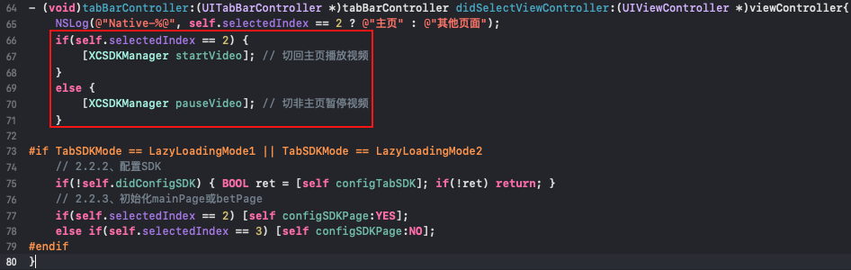
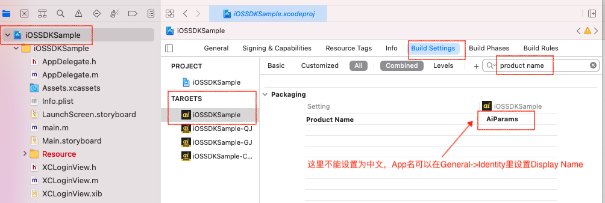
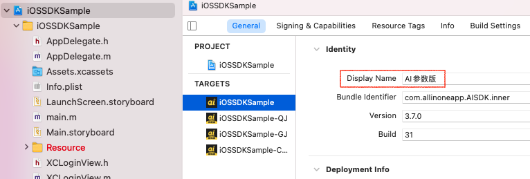

# Gbet体育SDK iOS接入文档

`此文档引导宿主App iOS端如何接入SDK`

## 目录
### [一、环境、兼容性等公共配置](#env-compatibility)
>##### [1、开发语言](#common1)
>##### [2、三方依赖管理](#common2)
>##### [3、开发工具](#common3)
>##### [4、系统兼容性](#common4)
>##### [5、SDK引入](#common5)
>##### [6、工程配置](#common6)
>>##### [6.1、Deployment Target设置成10.0或更高版本](#common6.1)
>>##### [6.2、Enable Bitcode 设置成NO](#common6.2)

>##### [7、info.plist(ATS、隐私等)配置](#common7)

### [二、Objective-C接入说明](#Objective-C)
> #### [具体接入](#oc-detail)
>> ##### [1、ICON版方式：启动SDK](#oc-detail1)
>> ##### [2、TAB版方式：配置SDK](#oc-detail2)

### [三、Swift接入说明](#Swift)
>##### [接入准备](#swift-start)
>> ###### [1、移除多window相关配置](#swift-start1)
>> ###### [2、添加Objective-C桥接] (#swift-start2)

> ##### [具体接入](#swift-detail)


#### [四、SDK接口说明](#info)
> ###### [1、配置商户信息、设置回调、启动SDK(ICON版方式)](#info1)
> ###### [2、配置SDK信息(TAB版方式)](#info2)
> ###### [3、获取SDK主页面](#info3)
> ###### [4、获取投注记录](#info4)
> ###### [5、获取页面ID列表](#info5)
> ###### [6、页面释放](#info6)
> ###### [7、查看SDK版本](#info7)
> ###### [8、视频暂停/播放](#info9)

#### [五、动画播放对环境要求](#webAnimation)

#### [六、如何获取config配置信息与文档](#gain-docs)

#### [七、config配置参数说明](#config-desc)
#### [八、常见问题](#common-problem)
#### [九、版本更新说明](#version-info)

<br>
## 文档
### <span id="env-compatibility" >一、环境、兼容性等公共配置</span>
>##### <span id="common1">1、开发语言：Objective-C、Swift</span>
>##### <span id="common2">2、三方依赖管理：CocoaPods【安装教程[1](https://www.jianshu.com/p/417b0e8bb027)、[2](http://www.code4app.com/article/cocoapods-install-usage)】</span>
>##### <span id="common3">3、开发工具：<font color='red'>Xcode请使用最新版本</font> </span>
>##### <span id="common4">4、系统兼容性：SDK仅支持<font color='red'>iOS10+</font>系统，建议使用iPhone7或更高配手机，<font color='red'>为精简包大小现仅支持真机！！！</font></span>
>#### <span id="common5">5、SDK引入<font color='red'>(pods管理本地代码方式引入！！！)</font> </span>
```
1、请将iOSSDK文件夹复制到工程文件夹下
2、Podfile添加：
pod 'XCSDK_iOS', :path => 'iOSSDK/iOSSDK.podspec'
pod 'AFNetworking', '~> 4.0.1' # Apple已禁止有UIWebView的IPA上传，SDK中已将版本升到4.0+
pod 'MBProgressHUD', '~> 1.1.0'
pod 'SDWebImage'
文件结构如下：
├── iOSSDKSample
│   ├── iOSSDK
│   │   ├── iOSSDK.podspec
│   │   └── frameworks
│   │    	  ├── App.framework
│   │       ├── XCSDK.framework
│   │       └── ...
│   ├── iOSSDKSample.xcodeproj
│   ├── iOSSDKSample.xcworkspace
│   ├── Podfile
│   ├── iOSSDKSample
│   │   └── ...
│   └── ...
└── ...
3、执行 pod install（如果失败对终端翻墙然后pod update）
```
<br>
>#### <span id="common6" >6、工程配置</span>
>>##### <span id="common6.1" >1、Deployment Target设置成10.0或更高版本</span>

>>##### <span id="common6.2" >2、Enable Bitcode 设置成NO</span>



>#### <span id="common7" >7、info.plist(ATS与隐私设置等)</span>
```objc
    <key>CFBundleDevelopmentRegion</key>
    <string>zh_CN</string>
	<key>NSAppTransportSecurity</key>
    <dict>
        <key>NSAllowsArbitraryLoads</key>
        <true/>
        <key>NSAllowsArbitraryLoadsInWebContent</key>
        <true/>
        <# 按需添加 异常域名 #>
        <key>NSExceptionDomains</key>
		 <dict>
			<key>your domain eg:baidu.com</key>
			<dict>
				<key>NSExceptionAllowsInsecureHTTPLoads</key>
				<true/>
				<key>NSIncludesSubdomains</key>
				<true/>
			</dict>
		 </dict>
    </dict>
    <key>io.flutter.embedded_views_preview</key>
    <string>YES</string>
```
<br>

### <span id="Objective-C" >二、Objective-C接入说明</span>

### <span id="oc-detail" >具体代码接入</span>
>#### <span id="oc-detail1" >1、ICON版方式：启动SDK<font color='red'>(示例代码如下)</font></span>
```objc
1、导入头文件
#import <XCSDK/XCSDK.h>
//
2、启动SDK
- (IBAction)launchSDKButton:(UIButton *)sender {
    NSError *error = nil;
    __weak __typeof(self) weakSelf = self;
    NSMutableDictionary *config = [@{
        XCSDKMainUrlKey     : self.config[XCSDKMainUrlKey] ?: @"",
        XCSDKImgUrlKey      : self.config[XCSDKImgUrlKey] ?: @"",
        XCSDKImUrlKey       : self.config[XCSDKImUrlKey] ?: @"",
        XCSDKTokenKey       : self.config[XCSDKTokenKey] ?: @"",
        XCSDKAppTypeKey     : self.config[XCSDKAppTypeKey] ?: @"",
    } mutableCopy];
    NSLog(@"config=%@", config);
    // 此方法（openSDKWithConfig:naviVC:error:handler:）即将废弃
    [XCSDKManager openIconSdk:config naviVC:self.navigationController configError:&error handler:^(NSString *_Nonnull method, NSDictionary * _Nullable params) {
        typeof(weakSelf) self = weakSelf;
        NSLog(@"method = %@, params=%@", method, params);
        NSString *showName = nil;
        if ([method isEqualToString:XCAppMethodExitSDK]) {
            // @"宿主App-主动退出SDK";
            [self readUserInfo];
            [self.navigationController popViewControllerAnimated:YES ];
        }
        else if ([method isEqualToString:XCAppMethodRetryAlert]) {  // 因网络问题下载SDK资源包失败，按需实现
            NSUInteger index = [params[@"index"] intValue];
            if (index == 0) {} // 重试
            else if (index == 1) {} // 去检查网络
        }
        else if ([method isEqualToString:XCAppMethodNeedLogin]) {
            [self showAnonymousLogninVC:params]; // 匿名登录模式进入，触发登录
        }
        else if ([method isEqualToString:XCAppMethodSystemRepair]) { // 系统维护-会回调多次(通过code/msg/whTime key获取相关信息)
            NSUInteger code = [params[@"code"] intValue];
            NSString *msg = params[@"msg"];
            NSString *whTime = params[@"whTime"];
            NSLog(@"code=%zd, msg=%@, whTime=%@", code, msg, whTime);
        }
    }];
    // 错误处理
    if (!!error) {
        NSLog(@"error=%@", error);
        NSString *msg = @"其他错误";
        switch (error.code) {
            case XCErrorCode_naviVCError:
            {
                msg = @"根控制器为空或类型错误";
                break;
            }
            case XCErrorCode_configError:
            {
                msg = @"配置信息错误或缺失";
                break;
            }
            default:
            {
                //...
                break;
            }
        }
    }
}
```
>#### <span id="oc-detail2" >2、TAB版方式：配置SDK<font color='red'>(示例代码如下)</font></span>
```objc
1、导入头文件
#import <XCSDK/XCSDK.h>
//
#define LazyLoadingMode1 1
#define LazyLoadingMode2 2
#define TabSDKMode LazyLoadingMode1 // 强烈建议使用懒加载方式2或1接入TabSDK
- (void)viewDidLoad {
    [super viewDidLoad];
#if TabSDKMode == LazyLoadingMode1
    // TODO:懒加载方式1：初始化viewControllers->>需要使用SDK时配置SDK->>初始化mainPage/betPage->>资源加载页/启动页加载时(不会挡住其他tab子页面)
    // 2.1.1、配置SDK
    BOOL ret = [self configTabSDK]; if(!ret) return;
    // 2.1.2、初始化viewControllers
    [self initViewControllers];
    // 2.1.3、使用的时候再初始化betPage或mainPage
    if (self.selectedIndex == 2) [self configSDKPage:YES]; // 默认选中mainPage则在此初始化
#elif TabSDKMode == LazyLoadingMode2
    // TODO:懒加载方式2：初始化viewControllers->>需要使用SDK时配置SDK->>初始化mainPage/betPage->>资源加载页/启动页加载时(不会挡住其他tab子页面)
    // 2.2.1、初始化viewControllers
    [self initViewControllers]; self.selectedIndex = 1;
#else
    // TODO:旧方式：先配置SDK->>初始化viewControllers->>初始化betPage和mainPage->>资源加载页/启动页加载时(会挡住其他tab子页面)
    /* 如需同时初始化betPage和mainPage，请先初始化betPage然后再初始化mainPage并用UINavigationController(或其子类)包装（如仅使用一个，初始化一个即可）
     包装示例比如：[[UINavigationVC alloc] initWithRootViewController:mainPage],或[[XCNavigationVC alloc] initWithRootViewController:mainPage] */
    // 1.1、配置SDK
    BOOL ret = [self configTabSDK]; if(!ret) return;
    // 1.2、初始化viewControllers
    [self initViewControllers];
    // 1.3、初始化betPage和mainPage
    self.betNavVC.viewControllers = @[[XCSDKManager betPage]];
    self.mainNavVC.viewControllers = @[[XCSDKManager mainPage]];
#endif
    [self initTabBar];
    self.delegate = self;
    self.view.backgroundColor = UIColor.orangeColor;
}
- (void)tabBarController:(UITabBarController *)tabBarController didSelectViewController:(UIViewController *)viewController{
#if TabSDKMode == LazyLoadingMode1 || TabSDKMode == LazyLoadingMode2
    // 2.2.2、配置SDK
    if(!self.didConfigSDK) { BOOL ret = [self configTabSDK]; if(!ret) return; }
    // 2.2.3、初始化mainPage或betPage
    if(self.selectedIndex == 2) [self configSDKPage:YES];
    else if(self.selectedIndex == 3) [self configSDKPage:NO];
#endif
}
```

### <span id="Swift" >三、Swift接入说明</span>
>#### <span id="swift-start" >接入准备</span>
>>##### <span id="swift-start1" >1、移除多window相关配置</span>
```objc
1.1、AppDelegate.swift文件中AppDelegate
  1.1.1：添加window属性：var window: UIWindow?
  1.1.2：注释或移除多屏代理方法
    //
    func application(_ application: UIApplication, configurationForConnecting connectingSceneSession: UISceneSession, options: UIScene.ConnectionOptions) -> UISceneConfiguration {
        return UISceneConfiguration(name: "Default Configuration", sessionRole: connectingSceneSession.role)
    }
    //
    func application(_ application: UIApplication, didDiscardSceneSessions sceneSessions: Set<UISceneSession>) {}
//
1.2、SceneDelegate.swift文件解除引用
//
1.3、info.plist移除多屏配置
<key>UIApplicationSceneManifest</key>
	<dict>
		<key>UIApplicationSupportsMultipleScenes</key>
		<false/> <# ----- 此处确保为false ----- #>
		<# ----- 删除以下内容 ----- #>
		<key>UISceneConfigurations</key>
		<dict>
			<key>UIWindowSceneSessionRoleApplication</key>
			<array>
				<dict>
					<key>UISceneConfigurationName</key>
					<string>Default Configuration</string>
					<key>UISceneDelegateClassName</key>
					<string>$(PRODUCT_MODULE_NAME).SceneDelegate</string>
					<key>UISceneStoryboardFile</key>
					<string>Main</string>
				</dict>
			</array>
		</dict>
		<# ----- 删除以上内容 ----- #>
	</dict>
```
>>##### <span id="swift-start2" >2、添加Objective-C桥接</span>


>#### <span id="swift-detail" >具体接入</span>
```objc
	// 获取token
    func queryConfig() {
        // 模拟获取登录token
        XCSDKUtils.simulateLogin(XCSDKConfigUAT, config: ["loginName": loginName, "passWord": passWord]) { (config, error) in
            self.data = config ?? [:];
            //NSLog("000-config=\(String(describing: config))")
        }
    }
    // 启动SDK
    @IBAction func launchSDK(_ sender: UIButton) {
        // 组装配置
        let config = [
            XCSDKMainUrlKey: self.data[XCSDKMainUrlKey],
            XCSDKImgUrlKey: self.data[XCSDKImgUrlKey],
            XCSDKImUrlKey: self.data[XCSDKImUrlKey],
            XCSDKTokenKey: self.data[XCSDKTokenKey],
            XCSDKAppTypeKey: self.data[XCSDKAppTypeKey],
        ]
        //NSLog("111-config=\(String(describing: config))")
        // 启动SDK
        XCSDKManager.openSDK(withConfig: config as? [String : String] ?? [:], naviVC: self.navigationController ?? UINavigationController.init(), error: nil) { (method, params) in
            NSLog("method\(method)")
        }
    }
```

<br>
<br>
### <span id="info" >四、SDK接口说明</span>
>#### <span id="info1" >1、配置商户信息、设置回调、启动SDK(ICON版方式)</span>
```objc
/// 启动SDK(配置商户信息、设置回调)
/// @param iconSdkConfig SDK相关配置
/// @param naviVC 宿主App导航控制器，SDK导航根控制器(SDK内部仅弱引用)
/// @param configError 配置错误信息
/// @param handler SDK事件回调
+ (void)openIconSdk:(NSDictionary<NSString *, id> *_Nonnull)iconSdkConfig
             naviVC:(UINavigationController *_Nonnull)naviVC
        configError:(NSError *__autoreleasing *)configError
            handler:(XCSDKHandler)handler;
```
>#### <span id="info2" >2、配置SDK信息(TAB版方式)</span>
```objc
/// 配置SDK信息(返回值：NO-配置失败，YES-配置成功)
/// @param sdkConfig SDK配置配置信息
/// @param tabbarVC 宿主App tabbarVC(SDK内部仅弱引用)
/// @param configError 配置错误信息
/// @param handler  SDK回调
+ (BOOL)configTabSdk:(NSDictionary<NSString *, id> *_Nonnull)sdkConfig
            tabbarVC:(UITabBarController *_Nonnull)tabbarVC
         configError:(NSError *__autoreleasing *)configError
             handler:(XCSDKHandler)handler;
```
>#### <span id="info3" >3、获取SDK主页面</span>
```objc
/// 单独获取SDK主页面
+ (UIViewController *_Nullable)mainPage;
```
>#### <span id="info4" >4、获取投注记录页面</span>
```objc
/// 单独获取SDK投注记录页面
+ (UIViewController * _Nullable)betPage;
```
>#### <span id="info5" >5、获取页面ID列表</span>
```objc
/// 获取页面ID列表
+ (NSArray *_Nullable)pageIds;
```
>#### <span id="info6" >6、页面释放</span>
```objc
/// 页面释放
/// @param pageIds nil-释放所有页面，非nil-释放指定页面如：@"mainPage"/@"memberBettingPage"
+ (void)destroyByPageIds:(NSArray<NSString *> *_Nullable)pageIds;
```
>#### <span id="info7" >7、查看SDK版本</span>
```objc
+ (NSString *_Nonnull)sdkVersion;
```

>#### <span id="info9" >9、视频播放/暂停</span>
```objc
/// 暂停视频
+ (void)pauseVideo;
/// 播放视频
+ (void)startVideo;
```


### <span id="webAnimation" >五、动画播放对环境要求</span>
```
(1) 支持js
(2) 支持http 及 https
(3) 支持websocket
(4) 当打开关闭遮罩通知功能时，WebView 需拦截 hybrid:协议的请求。否则会报错。若没进行拦截，请勿填写参数 hybrid 或设 hybrid 为 0。
(5) Iframe，当前没使用 iframe，但为了将来的扩展，建议在 webview 中支持该特性。
(6) 是部分 android 机型设置的字体过大会导致版面错乱的情况，android 客户端应设置 webview 的默认字体大小为 100。实现代码： webView.getSettings().setTextZoom(100)
```

### <span id="gain-docs" >六、如何获取config配置信息与文档</span>
>##### 1、<span id="gain-docs1" >在</span>[开放平台](https://xjadmin.fmafsale.com/)申请接入并审核通过后[方获取config配置](https://xjadmin.fmafsale.com/)
>##### 2、<span id="gain-docs2" >接入文档/SDK/Demo</span>[下载链接](https://xjadmin.fmafsale.com/)
```备注：如文档或SDK下载链接失效请联系客服人员```

### <span id="config-desc" >七、config配置参数说明: </span>
| key | 说明 |是否必传|备注|
|:------|:------:|:------:|:--------|
| XCSDKMainUrlKey | 基础url |<font color='red'>必传</font>| 默认值：无|
| XCSDKImgUrlKey | 资源url|<font color='red'>必传</font>| 默认值：无|
| XCSDKImUrlKey  | push服务url|<font color='red'>必传</font>|默认值：无|
| XCSDKTokenKey  | 登录token| 非必传 | 默认值：无，<font color='red'>不传或传空即为匿名登录</font>|
| XCSDKTypeKey  | SDK类型(TAB/ICON版)|<font color='red'>必传</font>| 默认值：iOS-内部已隐式传入<font color='red'>无需再传</font>，<font color='red'>安卓-需显式传入</font> |
| XCSDKAppTypeKey | App类型 |<font color='red'>必传</font>| 请传Gbet 默认值：无|
| XCSDKLaunchTitleKey | SDK启动标题 |<font color='red'>必传</font>| 默认值：不传显示Gbet |
| XCSDKLaunchSubTitlesKey | SDK启动子标题列表 | 非必传 | 默认值：见"XCSDKManager.h" |
### <span id="common-problem" >八、常见问题 </span>
#### 1、iOS14兼容性：因SDK内部使用FlutterSDK的版本是1.22.6，此版本<font color='red'>Product Name不支持中文(非UTF8)</font>，配置中文(非UTF8)会导致crash，如宿主App需要设置中文(非UTF8)App名请使用<font color='red'>Display Name</font>来替代
##### Product Name配置：<font color='red'>Product Name配置中文(非UTF8)</font>

##### Display Name配置


### <span id="version-info" >九、版本更新说明 </span>
| 更改日期 | 版本 |更改人|版本说明|审核人|
|:------|:------:|:------:|:--------|:---:|
| 2019-11-01 | 1.0.0 | eric | 创建|hank|
| 2019-11-15 | 1.1.0 | eric | 1.1需求相关| hank |
| 2019-11-22 | 1.1.1 | eric | 修改接入方式、Bug fixed| hank |
| 2019-12-06 | 1.1.2 | eric | 新增配置信息、Bug fixed| abraham |
| 2019-12-13 | 1.1.3 | eric | 优化接入流程、Bug fixed| abraham |
| 2019-12-20 | 1.2.0 | eric | 1.2需求相关、Bug fixed| alice/tab/abraham |
| 2019-12-27 | 1.2.1 | eric | 1.2需求相关、Bug fixed| isco/abraham |
| 2020-01-03 | 1.3.0V1 | eric | 新增1.3版本功能与相关配置<br>Bug fixed|isco/abraham |
| 2020-01-04 | 1.3.0V2 | eric | 新增示例代码|isco/abraham |
| 2020-01-09 | 1.3.0V3 | eric | 去掉相关配置，优化流程|isco/abraham |
| 2020-01-16 | 1.3.4 | eric | 快捷投注 |isco/abraham |
| 2020-03-01 | 1.5.1V1 | eric | 1.5.1新需求 |isco/abraham |
| 2020-03-09 | 1.5.1V2 | eric | 边沿侧滑返回宿主App可配置 |isco/abraham |
| 2020-04-03 | 1.6.4 | eric | 1.6.4需求 |isco/abraham |
| 2020-05-06 | 2.0.0 | eric | 2.0.0需求 |isco/abraham |
| 2020-05-25 | 2.1.0 | eric |【优化】全新的2.1界面升级，加入了动效，优化了交互细节，等你来细细发现 |isco/abraham |
| 2020-05-25 | 2.2.0V1 | eric | 2.2.0需求 |isco/abraham |
| 2020-06-12 | 2.2.0V2 | eric | SDK新增启动图配置项，优化内存 |isco/abraham |
| 2020-06-23 | 2.2.0V3 | eric | SDK减包 |isco/abraham |
| 2020-07-03 | 2.2.1 | eric | 2.2.1 new feature |isco/abraham |
| 2020-07-17 | 2.2.2 | eric | 2.2.2 new feature |isco/abraham |
| 2020-07-24 | 2.2.3 | eric | 2.2.3 new feature |isco/abraham |
| 2020-08-27 | 3.0.0 | eric | 新增页面方式集成方式 |isco/abraham |
| 2020-09-15 | 2.2.3V2<br>3.0.0V1 | eric | 支持Swift |isco/abraham |
| 2020-09-15 | 3.4.0 | eric | 1.TabSdk启动方式API变更, 简化接入流程</br>2.修复已知bug |isco/abraham |
| 2020-11-16 | 3.5.0 | eric | 1.新增TAB版token失效回调<br>2.新增系统维护回调<br>3.新增视图控制器生命周期方法回调 |isco/abraham |
| 2020-12-02 | 3.6.0 | eric | 1.优化投注错误提示<br>2.修改串关投注最低限额为2元<br>3.修复已知bug |isco/abraham |
| 2021-01-13 | 3.7.0 | eric | 1.优化比赛详情页性能</br>2.优化赔率点水交互效果</br>3.优化列表盘口开关盘及时性</br>4.修复已知bug</br> |isco/abraham |
| 2021-02-05 | 3.8.0 | eric |  1.修复已知bug，增强系统稳定性</br> |isco/abraham |
| 2021-03-10 | 3.8.5 | eric |  1.优化提前结算功能，提升结算成功率</br>2.修复比分遮罩层无法关闭bug</br>3.修复系统维护时，页面显示错误问题</br> |isco/abraham |
| 2021-04-09 | 3.9.0 | eric | 1.优化视频播放速度，修复视频偶现变形问题<br>2.新增注单延期结算标记<br>3.新增保留上一笔投注注单<br>4.取消震动效果<br>5.优化ios内存问题<br> |isco/abraham |
| 2021-04-25 | 3.10.0 | eric | 3.10.0需求 | ricky/abraham |
| 2021-05-27 | 3.10.2 | eric | 3.10.2需求 | ricky/abraham |
| 2021-06-09 | 3.12.0 | eric | 3.12.0需求 | ricky/abraham |
| 2021-06-10 | 3.12.1 | eric | 3.12.1需求 | ricky/abraham |
| 2021-06-12 | 3.12.2 | eric | 3.12.2需求 | ricky/abraham |
| 2021-06-13 | 3.12.3 | eric | 3.12.3需求 | ricky/abraham |
| 2021-06-23 | 3.12.4 | eric | 3.12.4需求 | ricky/abraham |
| 2021-08-18 | 3.13.0 | eric | 3.13.0需求 | ricky/abraham |
| 2021-09-07 | 3.13.1 | eric | 3.13.1需求 | ricky/abraham |
| 2021-10-18 | 3.14.6 | eric | 3.14.6需求 | ricky/abraham |
| 2021-11-29 | 3.14.6 | eric | 添加匿名登陆 | ricky/abraham |